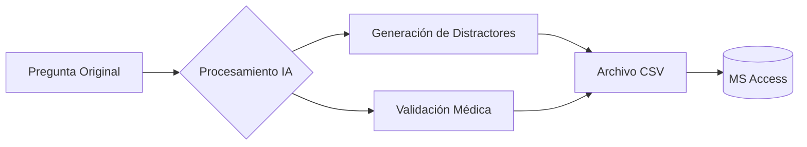

```markdown
# 🩺 Preparación para el Examen de Residencia de Medicina Interna

<p align="center">
  
  
  
</p>

---

## 📝 Descripción General

<div align="justify">
Este proyecto es una herramienta integral diseñada para la preparación del examen de <b>Residencia de Medicina Interna</b>. Su objetivo es generar un banco de preguntas y conceptos médicos verificados para optimizar el aprendizaje. Mediante el uso de IA, transformamos casos clínicos reales en material de estudio dinámico, asegurando la adherencia a la evidencia médica más reciente.
</div>

## 🚀 Características Principales

*   **🧬 Modificación Dinámica:** Alteración de contextos clínicos para evitar la memorización por patrón.
*   **🧠 Distractores Inteligentes:** Creación de opciones incorrectas plausibles que desafían el razonamiento clínico.
*   **📚 Justificación Basada en Evidencia:** Explicaciones detalladas con referencias bibliográficas actualizadas.
*   **📊 Estructura lista para DB:** Exportación optimizada a `.csv` para integración directa con **MS Access**.
*   **📖 Diccionario Médico:** Glosario especializado con definiciones concisas y completas.

## 📂 Estructura del Proyecto

| Archivo | Función |
| :--- | :--- |
| `preguntas.csv` | Banco de preguntas, distractores y explicaciones. |
| `conceptos.csv` | Diccionario de terminología médica esencial. |
| `scripts/` | (Próximamente) Herramientas de automatización y validación. |

## 🔄 Flujo de Trabajo (Workflow)



## 📈 Progreso del Proyecto

### **Estado Actual:**

*   **Fase 1:** Configuración de IA 🟢
*   **Fase 2:** Definición de Esquema DB 🟡
*   **Fase 3:** Carga de Preguntas ⚪
*   **Fase 4:** Diccionario de Conceptos ⚪

### **Métricas de Control:**

| Elemento             | Meta  | Actual | Progreso |
| :------------------- | :---- | :----- | :----------- |
| **Preguntas** | 1000+ | 0 | `░░░░░░░░░░` 0% |
| **Conceptos** | 500+ | 0 | `░░░░░░░░░░` 0% |
| **Validación** | 100% | 0 | `░░░░░░░░░░` 0% |

---
<p align="center">
  <b>Mantente actualizado con los cambios siguiendo este repositorio.</b><br>
  <i>"La medicina es una ciencia de incertidumbre y un arte de probabilidad." - William Osler</i>
</p>
```