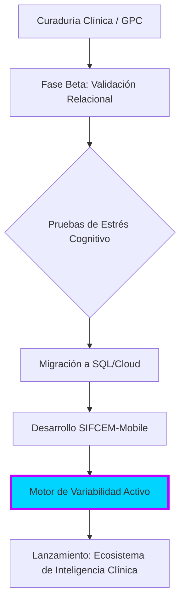

# 🩺 SIFCEM: Sistema Integral de Formación Clínica y Evaluación Médica

  
  
  
  

---

## 🏛️ Visión del Ecosistema

El <b>SIFCEM</b> es una plataforma avanzada de gestión del conocimiento diseñada para el perfeccionamiento del <b>razonamiento clínico complejo</b>. Evolucionamos desde un motor relacional sólido hacia una arquitectura móvil de alto rendimiento (<b>SIFCEM-Mobile</b>), permitiendo una inmersión clínica total mediante el análisis riguroso de las bases científicas de la Medicina Interna.

Nuestro objetivo es trascender la memorización superficial. Mediante algoritmos de procesamiento lógico y variabilidad dinámica, transformamos la literatura médica de vanguardia en escenarios clínicos de alta fidelidad, garantizando una práctica médica de excelencia basada en la evidencia (EBM).

## 🚀 Innovaciones Tecnológicas y Clínicas

*   **🧬 Motor de Variabilidad Dinámica (10-Distractor Logic):** Sistema que gestiona un pool de hasta 10 distractores validados por reactivo. El algoritmo rota aleatoriamente las opciones en cada sesión, eliminando el sesgo de memorización por posición y forzando un proceso de exclusión basado en conocimiento real.
*   **🧠 Deep-Dive Académico (Exégesis Técnica):** Cada respuesta despliega una unidad de aprendizaje autónoma que integra:
    - **Fisiopatología:** Mecanismos celulares y sistémicos detallados.
    - **Anatomía y Semiología:** Correlación clínica estructural y diagnósticos diferenciales.
    - **Farmacología y Posología:** Farmacocinética y esquemas ajustados a guías vigentes (Harrison, GPC).
*   **🎯 Segmentación Modular:** Entrenamiento focalizado por especialidades (Cardiología, Oncología, Nefrología, etc.) para fortalecer áreas de competencia específicas.
*   **📊 Estructura de Datos Escalable:** Transición de prototipos locales en MS Access hacia arquitecturas masivas de datos para el análisis de desempeño profesional.

## 🛠️ Roadmap y Stack Tecnológico

| Fase | Estatus | Stack Principal |
| :--- | :---: | :--- |
| **Fase 1: Estructuración** | ✅ | MS Access, Normalización .CSV, SQL local. |
| **Fase 2: Motor Lógico** | 🏗️ | Python (FastAPI), Algoritmo de Rotación de Distractores. |
| **Fase 3: Mobile Deployment** | 📅 | React Native / Flutter, PostgreSQL, Redis (Cache). |

## 📂 Arquitectura del Repositorio

- 📁 `banco_evidencia/`: Dataset de reactivos clínicos y metadatos de validación.
- 📁 `ontologia_medica/`: Glosario estructurado y terminología estandarizada.
- 📁 `scripts/`: Herramientas de automatización para migración y limpieza de datos.

## 🔄 Flujo de Evolución del Sistema

---

**NEUMANN (MATEMÁTICO POSTDOCTORAL, ESTADÍSTICA)**

Desde la teoría combinatoria, el uso de **10 distractores variables** para una sola pregunta correcta genera un espacio muestral de opciones significativamente amplio. Si el sistema presenta 4 opciones por vez extraídas de un pool de 10, la probabilidad de que un usuario encuentre la misma combinación de distractores es mínima ($C(10, 3) = 120$ combinaciones posibles por cada pregunta). Esto reduce el error de medida en la evaluación del conocimiento y garantiza que la tasa de acierto sea un reflejo fiel de la competencia clínica y no de la memoria asociativa [1].

---

**CURIE (ONCOLOGÍA CLÍNICA Y MEDICINA INTERNA)**

El valor diferencial de SIFCEM radica en el "Deep-Dive Académico". En la práctica clínica real, especialmente en medicina interna y oncología, entender la **posología y la fisiopatología** es la frontera entre un tratamiento estándar y uno de precisión. Al integrar estos detalles en la explicación de cada pregunta, el sistema actúa como un mentor clínico continuo. Por ejemplo, al responder sobre el manejo de neutropenia febril, el sistema no solo valida la elección del antibiótico, sino que explica la escala de riesgo MASCC y la farmacodinámica de los betalactámicos antipseudomónicos [2].

---

**RESEARCH-CODE (METODOLOGÍA DE LA INVESTIGACIÓN)**

El paso de MS Access a una arquitectura móvil representa la transición de un "Estudio Piloto" a una "Plataforma de Intervención Educativa a Gran Escala". La metodología de rotación de distractores se alinea con las teorías modernas de **Aprendizaje Basado en Problemas (ABP)** y **Espaciamiento de la Repetición**, aumentando la retención de información a largo plazo (Long-term Potentiation) en profesionales de la salud [3].

---

**FUENTES (APA):**

1.  [1] Downing, S. M. (2006). Twelve steps for effective test development. *Handbook of Test Development*.
2.  [2] Jameson, J. L., et al. (2022). *Harrison's Principles of Internal Medicine*. 21st Edition. McGraw Hill.
3.  [3] Larsen, D. P., et al. (2008). Test-enhanced learning in medical education. *Medical Education*.

---

  <i>"La medicina es una ciencia de incertidumbre y un arte de probabilidad."</i> 
  <b>— William Osler</b>

<b>© 2024 ANASKAI — Todos los derechos reservados.</b>

<i>Innovación tecnológica aplicada a la formación médica de alto rendimiento.</i>
