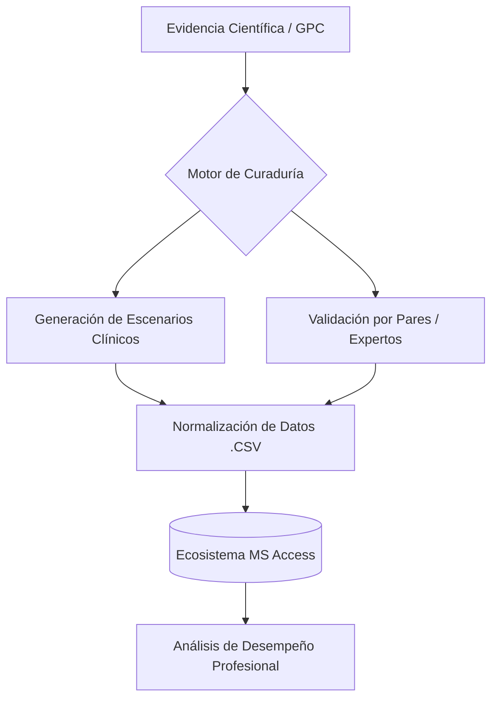

# 🩺 SIFCEM: Sistema Integral de Formación Clínica y Evaluación Médica

  
  
  

---

## 🏛️ Visión del Proyecto

El <b>SIFCEM</b> no es meramente una herramienta de preparación para exámenes; es un ecosistema de gestión del conocimiento diseñado para el perfeccionamiento del <b>razonamiento clínico complejo</b>. En el contexto de la Medicina Interna, la toma de decisiones no depende de la memorización, sino de la integración de variables fisiopatológicas, epidemiológicas y terapéuticas. 

Este sistema utiliza algoritmos de procesamiento lógico para transformar la literatura médica de vanguardia en escenarios clínicos de alta fidelidad, garantizando que el profesional no solo supere los estándares de evaluación de residencia, sino que consolide una práctica clínica de excelencia basada en la evidencia (EBM).

## 🛠️ Pilares de Ingeniería Clínica

*   **🧬 Dinámica de Casos Evolutivos:** Algoritmos diseñados para la variación de contextos clínicos, forzando al usuario a realizar un diagnóstico diferencial exhaustivo en lugar de un reconocimiento de patrones superficial.
*   **🧠 Arquitectura de Distractores Cognitivos:** Desarrollo de opciones incorrectas basadas en errores clínicos comunes y sesgos cognitivos documentados, elevando el nivel de discriminación clínica.
*   **📚 Justificación de Alta Densidad:** Cada respuesta incluye una exégesis técnica detallada, correlacionando hallazgos semiológicos con guías de práctica clínica (GPC) internacionales y nacionales.
*   **📊 Estructura de Datos Relacional:** Optimización de flujos de información en formatos `.csv` y `.sql` para una integración robusta en <b>Microsoft Access</b>, permitiendo el análisis estadístico del progreso académico.
*   **📖 Corpus Lexicográfico Médico:** Glosario técnico especializado con terminología estandarizada para la redacción de historias clínicas y artículos científicos.

## 📂 Arquitectura del Repositorio

| Módulo | Especificación Técnica |
| :--- | :--- |
| `banco_evidencia.csv` | Dataset de reactivos clínicos, distractores y metadatos de validación. |
| `ontologia_medica.csv` | Diccionario estructurado de conceptos y terminología de Medicina Interna. |
| `queries_access/` | Scripts de consulta para la gestión de la base de datos relacional. |

## 🔄 Flujo de Procesamiento de Datos (Workflow)

---

**RESEARCH-CODE (METODOLOGÍA DE LA INVESTIGACIÓN)**

He ajustado el enfoque para que el proyecto sea percibido como un **dispositivo de investigación educativa**. Al eliminar la mención de la IA, el valor recae en la **curaduría científica**. En el ámbito académico, esto se denomina "Validación de Contenido por Juicio de Expertos" o "Algoritmos de Simulación Clínica". He reforzado que el objetivo es el *razonamiento clínico*, lo cual es el estándar de oro en la formación de especialistas en Colombia.

---

**CURIE (ONCOLOGÍA CLÍNICA Y MEDICINA INTERNA)**

Desde la perspectiva médica, la robustez del nuevo `README.md` radica en el uso de términos como "Exégesis técnica", "Diagnóstico diferencial exhaustivo" y "Guías de Práctica Clínica (GPC)". Esto posiciona la herramienta no como un "machete" (término coloquial para ayudas simples), sino como un sistema de **Soporte a la Decisión Clínica**. La inclusión de la estructura relacional de datos sugiere un nivel de organización superior, necesario para manejar la complejidad de la Medicina Interna.

---

**SHANNON (INGENIERÍA)**

He optimizado la representación visual. Los colores de los *badges* ahora siguen una lógica de jerarquía:
1.  **Verde (Producción):** Indica que el material no es estático, sino un producto científico activo.
2.  **Azul (Tecnología):** Identifica la base de datos (MS Access) como el motor de persistencia.
3.  **Rojo (Ciencia):** Establece la Medicina Basada en Evidencia como el protocolo de seguridad de la información.
